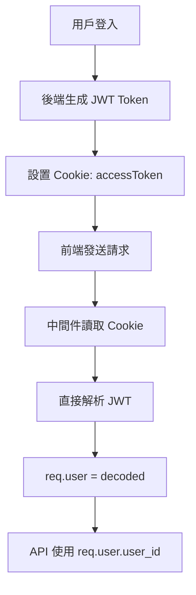
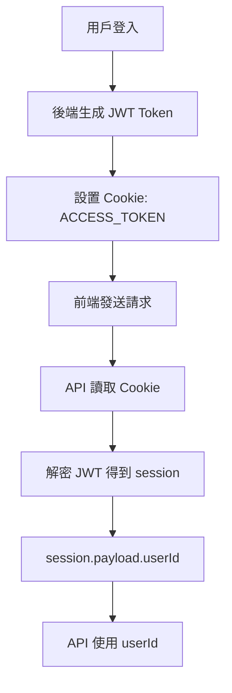

# Session vs Cookie 認證機制說明

## 📋 概述

本文檔詳細說明 `session?.payload?.userId` 和 cookie 認證機制的差異，以及它們在 Next.js 應用中的使用方式。

## 🔍 核心概念對比

### 1. **Cookie 認證方式** (你提供的 Express.js 範例)

```javascript
// Express.js 後端設置 Cookie
res.cookie('accessToken', accessToken, {
  httpOnly: false, // 讓前端可以讀取
  secure: process.env.NODE_ENV === 'production',
  sameSite: process.env.NODE_ENV === 'production' ? 'none' : 'lax',
  maxAge: 3 * 24 * 60 * 60 * 1000, // 3 days
  path: '/'
})

// Express.js 中間件驗證
const token = req.cookies.accessToken || req.headers.authorization?.split(' ')[1]
const decoded = jwt.verify(token, accessTokenSecret)
req.user = decoded // 直接將用戶資料存到 req.user
```

### 2. **Session 認證方式** (Next.js 專案使用)

```javascript
// Next.js 後端設置 Cookie
const cookie = (await cookies()).get('ACCESS_TOKEN')?.value
const session = await decrypt(cookie)
const userId = session?.payload?.userId
```

## 🔄 認證流程對比

### **Cookie 認證流程** (Express.js 方式)



### **Session 認證流程** (Next.js 方式)



## 📊 詳細差異分析

| 特性 | Cookie 認證 (Express.js) | Session 認證 (Next.js) |
|------|-------------------------|----------------------|
| **Token 存儲** | `req.cookies.accessToken` | `cookies().get('ACCESS_TOKEN')` |
| **解析方式** | `jwt.verify(token, secret)` | `decrypt(cookie)` |
| **用戶資料** | `req.user.user_id` | `session.payload.userId` |
| **中間件** | 需要 `authenticate` 中間件 | 每個 API 自行處理 |
| **錯誤處理** | 中間件統一處理 | 每個 API 自行處理 |
| **性能** | 較快（中間件快取） | 較慢（每次解密） |
| **安全性** | 中等 | 較高（額外加密層） |

## 🔐 安全性對比

### **Cookie 認證安全性**

```javascript
// ✅ 優點
- JWT 自帶簽名驗證
- 可以設置 httpOnly, secure, sameSite
- Token 過期自動失效

// ⚠️ 缺點
- JWT 內容可被解碼（非加密）
- 需要額外驗證邏輯
- 中間件可能被繞過
```

### **Session 認證安全性**

```javascript
// ✅ 優點
- 額外的加密層（decrypt 函數）
- 每次 API 調用都重新驗證
- 更細粒度的權限控制

// ⚠️ 缺點
- 性能開銷較大
- 需要更多代碼維護
- 解密失敗時處理複雜
```

## 🛠️ 實際使用範例

### **Express.js Cookie 認證範例**

```javascript
// 1. 登入設置 Cookie
router.post('/login', async (req, res) => {
  const { email, password } = req.body
  
  // 驗證用戶
  const user = await validateUser(email, password)
  
  // 生成 JWT
  const token = jwt.sign(
    { user_id: user.user_id, email: user.email },
    process.env.ACCESS_TOKEN_SECRET,
    { expiresIn: '3d' }
  )
  
  // 設置 Cookie
  res.cookie('accessToken', token, {
    httpOnly: false,
    secure: process.env.NODE_ENV === 'production',
    sameSite: 'lax',
    maxAge: 3 * 24 * 60 * 60 * 1000
  })
  
  res.json({ status: 'success', data: { accessToken: token } })
})

// 2. 中間件驗證
export default function authenticate(req, res, next) {
  const token = req.cookies.accessToken
  
  if (!token) {
    return res.status(401).json({ message: '沒有存取令牌' })
  }
  
  try {
    const decoded = jwt.verify(token, process.env.ACCESS_TOKEN_SECRET)
    req.user = decoded // 直接存到 req.user
    next()
  } catch (error) {
    return res.status(401).json({ message: '不合法的存取令牌' })
  }
}

// 3. API 使用
router.get('/profile', authenticate, (req, res) => {
  // 直接使用 req.user.user_id
  const userId = req.user.user_id
  // ... 處理邏輯
})
```

### **Next.js Session 認證範例**

```javascript
// 1. 登入設置 Cookie (在 API Route 中)
export async function POST(request) {
  const { email, password } = await request.json()
  
  // 驗證用戶
  const user = await validateUser(email, password)
  
  // 生成 JWT
  const token = jwt.sign(
    { userId: user.user_id, email: user.email },
    process.env.ACCESS_TOKEN_SECRET,
    { expiresIn: '3d' }
  )
  
  // 設置 Cookie
  const response = NextResponse.json({ status: 'success' })
  response.cookies.set('ACCESS_TOKEN', token, {
    httpOnly: true,
    secure: process.env.NODE_ENV === 'production',
    sameSite: 'lax',
    maxAge: 3 * 24 * 60 * 60 * 1000
  })
  
  return response
}

// 2. API 驗證 (每個 API 自行處理)
export async function PUT(request) {
  // 讀取 Cookie
  const cookie = (await cookies()).get('ACCESS_TOKEN')?.value
  
  // 解密得到 session
  const session = await decrypt(cookie)
  
  // 驗證用戶身份
  if (!session?.payload?.userId) {
    return NextResponse.json({ message: '授權失敗' }, { status: 401 })
  }
  
  // 使用 userId
  const userId = session.payload.userId
  // ... 處理邏輯
}
```

## 🎯 選擇建議

### **選擇 Cookie 認證的情況**

- ✅ 需要高性能的應用
- ✅ 有統一的認證中間件
- ✅ 簡單的權限控制
- ✅ Express.js 後端

### **選擇 Session 認證的情況**

- ✅ 需要高安全性的應用
- ✅ 複雜的權限控制
- ✅ Next.js App Router
- ✅ 需要細粒度控制

## 🔧 遷移建議

如果你要從 Express.js Cookie 認證遷移到 Next.js Session 認證：

1. **保持 Cookie 名稱一致**：`accessToken` → `ACCESS_TOKEN`
2. **調整 JWT 結構**：`user_id` → `userId`
3. **移除中間件**：每個 API 自行處理認證
4. **更新前端**：調整 Cookie 讀取方式
5. **測試認證流程**：確保所有 API 正常運作

## 📝 總結

- **Cookie 認證**：適合快速開發，性能較好，但安全性中等
- **Session 認證**：適合高安全性需求，控制更細緻，但性能開銷較大
- **選擇依據**：根據專案需求、安全要求、性能要求來決定

兩種方式都是有效的認證機制，關鍵是選擇適合你專案需求的方式。

