# Prisma Schema 檔案關係與差異詳細解釋

## 1. schema.prisma 不是編譯過的檔案

你說得**完全正確**！我之前的說法有誤，很抱歉造成混淆。

### 正確的理解：

- **`prisma/schema.prisma`** 是你**手寫的原始定義檔**
- 它不是編譯過的檔案，而是 Prisma Schema Definition Language (SDL) 檔案
- 這是你的**資料庫設計藍圖**

### 錯誤的理解（我之前說的）：

- ❌ "schema.prisma 是編譯過的檔案"
- ❌ "它是從其他地方生成的"

## 2. 兩個 schema.prisma 檔案的關係

### 檔案位置對比：

```
C:\coding\next-one-main\prisma\schema.prisma                    ← 主檔案
C:\coding\next-one-main\prisma\generated\client\schema.prisma   ← 生成檔案
```

### 檔案內容分析：

從你提供的檔案內容來看，這兩個檔案**幾乎完全相同**，只有微小的差異：

**主檔案 (prisma/schema.prisma)**：

```prisma
model User {
  user_id         Int            @id @default(autoincrement())
  current_log_count Int          @default(0) @map("current_log_count")
  // ... 其他欄位
}
```

**生成檔案 (prisma/generated/client/schema.prisma)**：

```prisma
model User {
  user_id           Int       @id @default(autoincrement())
  current_log_count Int       @default(0) @map("current_log_count")
  // ... 其他欄位
}
```

### 差異分析：

1. **格式差異**：生成檔案可能會有不同的格式化
2. **註解差異**：某些註解可能被移除或修改
3. **內容本質**：資料模型定義完全相同

## 3. 為什麼會有兩個相同的檔案？

### Prisma 的工作流程：

```mermaid
graph LR
    A[prisma/schema.prisma<br/>手寫藍圖] --> B[npx prisma generate]
    B --> C[prisma/generated/client/<br/>生成的 Prisma Client]
    C --> D[應用程式使用]
```



### 具體過程：

1. **你手寫** `prisma/schema.prisma`
2. **執行** `npx prisma generate`
3. **Prisma 讀取** 你的 schema.prisma
4. **生成** Prisma Client（包含 schema.prisma 的副本）
5. **應用程式** 使用生成的 Prisma Client

### 生成檔案的作用：

- **內部使用**：Prisma Client 需要知道資料模型定義
- **型別檢查**：TypeScript 型別定義的來源
- **執行時參考**：Prisma Client 執行時的模型資訊

## 4. WASM 是什麼？

### WebAssembly (WASM) 簡介：

**WASM** 是一種低階的二進位指令格式，可以在各種環境中高效執行。

### WASM 的特點：

- **高效能**：執行速度接近原生程式碼
- **可移植性**：可在瀏覽器、Node.js、伺服器等環境運行
- **安全性**：沙盒環境，安全性高

### Prisma 中 WASM 的用途：

```javascript
// 在你的圖片中看到的檔案
JS wasm-compiler-edge.js
JS wasm-engine-edge.js
```

**作用**：

1. **查詢引擎**：Prisma 的查詢引擎被編譯成 WASM
2. **邊緣運算**：支援 Vercel Edge Functions、Cloudflare Workers
3. **效能優化**：比 JavaScript 更快
4. **部署靈活性**：可在受限環境中運行

### 為什麼需要 WASM？

```javascript
// 傳統 Node.js 環境
prisma.user.findMany() → 原生二進位查詢引擎

// 邊緣運算環境（如 Vercel Edge）
prisma.user.findMany() → WASM 查詢引擎
```

## 5. migrations 資料夾中的 schema.prisma

### 重要警告：

**你絕對不應該修改 `migrations` 資料夾中的 `schema.prisma`！**

### migrations 資料夾結構：

```
prisma/migrations/
├── 20240101000000_init/
│   ├── migration.sql
│   └── schema.prisma  ← 這是歷史快照
├── 20240102000000_add_user/
│   ├── migration.sql
│   └── schema.prisma  ← 這是歷史快照
└── ...
```

### 這些檔案的作用：

- **歷史記錄**：記錄每次遷移時的資料庫狀態
- **遷移追蹤**：Prisma 用來判斷需要應用哪些變更
- **回滾支援**：可以回到之前的資料庫狀態

### 正確的工作流程：

```javascript
// 1. 只修改主檔案
// prisma/schema.prisma
model PaymentOrder {
  // 你的修改
}

// 2. 生成遷移
npx prisma migrate dev --name update_payment_order

// 3. Prisma 自動處理
// - 比較當前 schema 和上次快照
// - 生成 SQL 遷移腳本
// - 更新資料庫
// - 生成新的快照
```

## 6. 實際操作建議

### 修改資料庫模型的正確步驟：

```bash
# 1. 只修改主檔案
# 編輯 prisma/schema.prisma

# 2. 生成遷移
npx prisma migrate dev --name your_change_name

# 3. 重新生成 Prisma Client
npx prisma generate

# 4. 同步資料庫（如果需要）
npx prisma db push
```

### 絕對不要做的事情：

- ❌ 修改 `prisma/generated/client/schema.prisma`
- ❌ 修改 `prisma/migrations/*/schema.prisma`
- ❌ 手動修改遷移檔案

### 如果已經修改了錯誤的檔案：

```bash
# 1. 恢復 migrations 資料夾
git checkout prisma/migrations/

# 2. 重新生成遷移
npx prisma migrate reset
npx prisma migrate dev --name initial_migration

# 3. 重新生成 Prisma Client
npx prisma generate
```

## 總結

### 檔案關係：

- **`prisma/schema.prisma`**：你手寫的藍圖（唯一需要修改的）
- **`prisma/generated/client/schema.prisma`**：生成的副本（自動生成）
- **`prisma/migrations/*/schema.prisma`**：歷史快照（絕對不要修改）

### 工作流程：

1. 修改主 schema.prisma
2. 執行 `prisma migrate dev`
3. 執行 `prisma generate`
4. 使用生成的 Prisma Client

### 重要原則：

- **單一真實來源**：只有 `prisma/schema.prisma` 是權威
- **自動生成**：其他檔案都由 Prisma 自動管理
- **不要手動修改**：生成的檔案會被覆蓋

記住：**只修改 `prisma/schema.prisma`，其他檔案讓 Prisma 自動處理！** 🎯
