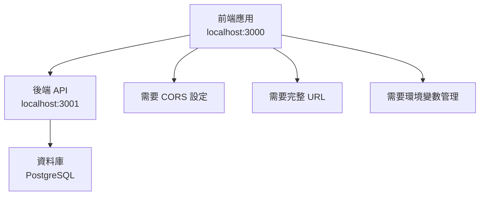
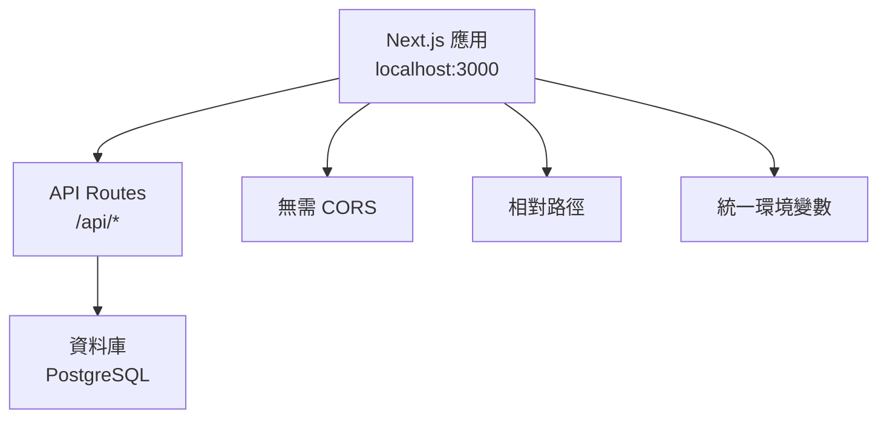

# Next.js API Routes 與後端根目錄說明

## 📋 概述

本文檔詳細說明為什麼在 Next.js 應用中使用 API Routes 時不需要指定後端根目錄，以及這種設計的優勢和原理。

## 🔍 核心概念

### **Next.js API Routes 的工作原理**

Next.js API Routes 是 Next.js 內建的後端功能，它將前端和後端整合在同一個應用中。

```javascript
// ❌ 傳統方式 - 需要指定完整的後端 URL
const response = await fetch('http://localhost:3001/api/auth/login', {
  method: 'POST',
  headers: { 'Content-Type': 'application/json' },
  body: JSON.stringify({ email, password })
})

// ✅ Next.js API Routes 方式 - 使用相對路徑
const response = await fetch('/api/auth/local/login', {
  method: 'POST',
  headers: { 'Content-Type': 'application/json' },
  body: JSON.stringify({ email, password })
})
```

## 🏗️ 架構對比

### **傳統分離式架構**



**特點**：
- 前端和後端分別運行在不同端口
- 需要配置 CORS（跨域資源共享）
- 需要管理多個環境變數
- 部署時需要分別部署兩個應用

### **Next.js 整合式架構**



**特點**：
- 前端和後端整合在同一個應用中
- 自動處理 CORS（同源請求）
- 使用相對路徑，無需指定完整 URL
- 統一部署和環境管理

## 🔧 技術實現細節

### **1. 相對路徑的工作原理**

```javascript
// 在 hooks/use-auth.js 中
const response = await fetch('/api/auth/local/login', {
  method: 'POST',
  headers: { 'Content-Type': 'application/json' },
  body: JSON.stringify({ email, password })
})
```

**為什麼不需要後端根目錄**：

1. **同源請求**：前端和 API 都在同一個 Next.js 應用中
2. **自動路由**：Next.js 自動將 `/api/*` 路由到對應的 API Route 文件
3. **環境無關**：無論在開發、測試還是生產環境，相對路徑都有效

### **2. Next.js 路由映射**

```
文件結構：
app/
├── (api)/
│   └── api/
│       └── auth/
│           └── local/
│               └── login/
│                   └── route.js

URL 映射：
/api/auth/local/login → app/(api)/api/auth/local/login/route.js
```
自動路由映射
### **3. 環境變數處理**

```javascript
// ❌ 傳統方式 - 需要管理多個環境變數
const API_BASE_URL = process.env.NEXT_PUBLIC_API_URL || 'http://localhost:3001'
const response = await fetch(`${API_BASE_URL}/api/auth/login`)

// ✅ Next.js 方式 - 無需環境變數
const response = await fetch('/api/auth/local/login')
```
環境無關性
## 📊 優勢對比

| 特性 | 傳統分離式 | Next.js 整合式 |
|------|------------|----------------|
| **CORS 設定** | 需要配置 | 自動處理 |
| **URL 管理** | 需要完整 URL | 相對路徑即可 |
| **環境變數** | 多個環境變數 | 統一管理 |
| **部署複雜度** | 需要分別部署 | 單一部署 |
| **開發體驗** | 需要啟動兩個服務 | 單一命令啟動 |
| **類型安全** | 需要額外配置 | 內建 TypeScript 支援 |

## 🚀 實際應用範例

### **登入 API 實現**

```javascript
// app/(api)/api/auth/local/login/route.js
import { NextResponse } from 'next/server'
import { login } from '@/services/auth.service'
import { createSession } from '@/lib/jwt-session'

export async function POST(request) {
  const body = await request.json()
  const data = await login(body)
  
  if (data?.status === 'success') {
    const payload = { userId: data?.payload?.user?.id }
    await createSession(payload, '3d', 'ACCESS_TOKEN')
    return NextResponse.json(data.payload)
  } else {
    return NextResponse.json({ message: data?.message }, { status: 400 })
  }
}
```

### **前端調用**

```javascript
// hooks/use-auth.js
const login = useCallback(async (email, password) => {
  const response = await fetch('/api/auth/local/login', {
    method: 'POST',
    headers: { 'Content-Type': 'application/json' },
    credentials: 'include',
    body: JSON.stringify({ email, password })
  })
  
  const result = await response.json()
  // 處理回應...
}, [])
```

## 🔒 安全性考量

### **1. 同源策略優勢**

```javascript
// ✅ 同源請求 - 自動安全
fetch('/api/auth/local/login') // 同源，無需 CORS

// ❌ 跨域請求 - 需要額外安全配置
fetch('http://other-domain.com/api/login') // 跨域，需要 CORS
```

### **2. Cookie 處理**

```javascript
// Next.js API Routes 自動處理 Cookie
export async function POST(request) {
  // 自動讀取請求中的 Cookie
  const cookies = request.cookies.get('ACCESS_TOKEN')
  
  // 自動設置回應 Cookie
  const response = NextResponse.json(data)
  response.cookies.set('ACCESS_TOKEN', token, {
    httpOnly: true,
    secure: process.env.NODE_ENV === 'production',
    sameSite: 'lax',
    maxAge: 3 * 24 * 60 * 60 * 1000
  })
  
  return response
}
```

## 🌐 部署環境適應

### **開發環境**

```javascript
// 開發環境：localhost:3000
fetch('/api/auth/local/login')
// 實際請求：http://localhost:3000/api/auth/local/login
```

### **生產環境**

```javascript
// 生產環境：https://yourdomain.com
fetch('/api/auth/local/login')
// 實際請求：https://yourdomain.com/api/auth/local/login
```

**自動適應**：無需修改代碼，Next.js 自動處理不同環境的 URL。

## 🔄 與傳統後端的整合

### **何時需要後端根目錄**

```javascript
// 當你需要調用外部 API 時
const response = await fetch('https://api.external-service.com/data', {
  method: 'GET',
  headers: { 'Authorization': `Bearer ${token}` }
})

// 當你有多個後端服務時
const response = await fetch(`${process.env.NEXT_PUBLIC_API_URL}/api/users`)
```

### **混合使用場景**

```javascript
// 內部 API - 使用相對路徑
const internalResponse = await fetch('/api/auth/local/login')

// 外部 API - 使用完整 URL
const externalResponse = await fetch('https://api.github.com/user')
```

## 📝 最佳實踐

### **1. API 路由組織**

```
app/(api)/api/
├── auth/
│   ├── local/
│   │   ├── login/route.js
│   │   └── logout/route.js
│   └── google/
│       └── login/route.js
├── users/
│   ├── me/route.js
│   └── [id]/route.js
└── timelogs/
    ├── route.js
    └── [id]/route.js
```

### **2. 錯誤處理**

```javascript
// 統一的錯誤處理
export async function POST(request) {
  try {
    const data = await processRequest(request)
    return NextResponse.json(data)
  } catch (error) {
    return NextResponse.json(
      { message: error.message },
      { status: error.status || 500 }
    )
  }
}
```

### **3. 中間件使用**

```javascript
// middleware.js
import { NextResponse } from 'next/server'

export function middleware(request) {
  // 對 API 路由進行認證檢查
  if (request.nextUrl.pathname.startsWith('/api/protected')) {
    const token = request.cookies.get('ACCESS_TOKEN')
    if (!token) {
      return NextResponse.json({ message: 'Unauthorized' }, { status: 401 })
    }
  }
  
  return NextResponse.next()
}
```

## 🎯 總結

### **為什麼不需要後端根目錄**

1. **同源架構**：前端和後端在同一個 Next.js 應用中
2. **自動路由**：Next.js 自動處理 API 路由映射
3. **環境無關**：相對路徑在所有環境中都能正常工作
4. **簡化開發**：無需管理多個服務和環境變數
5. **統一部署**：單一應用，統一部署流程

### **適用場景**

- ✅ **全端 Next.js 應用**：前端 + 後端都在 Next.js 中
- ✅ **API 優先設計**：使用 Next.js API Routes
- ✅ **快速原型開發**：無需複雜的後端設置
- ✅ **單一團隊開發**：前端和後端由同一團隊維護

### **不適用場景**

- ❌ **微服務架構**：需要多個獨立的後端服務
- ❌ **現有後端系統**：已有獨立的後端 API
- ❌ **大型企業應用**：需要複雜的後端架構
- ❌ **多語言後端**：後端使用非 JavaScript 語言

## 🔗 相關文檔

- `docs/11-session-vs-cookie-authentication.md` - 認證機制對比
- `docs/12-authentication-scenarios-and-solutions.md` - 認證情境題
- Next.js 官方文檔：API Routes
- Next.js 官方文檔：Middleware

## 🚀 下一步

1. **學習 API Routes 進階功能**：中間件、動態路由、流式回應
2. **優化 API 性能**：快取策略、資料庫優化
3. **實作認證系統**：JWT、OAuth、Session 管理
4. **部署和監控**：生產環境部署、錯誤監控
